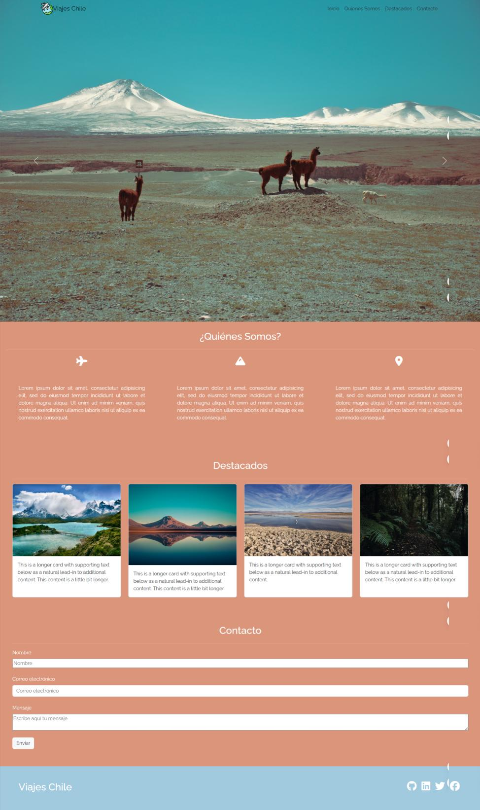

# Título del proyecto

Desafío: Landing Viajes Chile

## Descripción del proyecto

La agencia Viajes Chile solicita la creación de su landing page, que tenga un diseño atractivo e innovador, utilizando los conocimientos que has adquirido a través de las distintas
unidades. Para esto, puedes guiarte por la siguiente estructura:
La página debe contener las siguientes secciones:
● Una barra de navegación fija en la parte superior de la pantalla, con el logo y links a
diferentes secciones de la página, haciendo un smooth scroll.
● Un carousel que muestre las imágenes destacadas del sitio.
● Una sección de presentación, utilizando favicons y 3 párrafos (debe desaparecer en tamaños pequeños de pantalla).
● Una sección de destacados, que muestre 4 cards (tarjetas) con la imagen e información asociada.
● Una sección de formulario de contacto.
● Una sección footer con links a las redes sociales.

## Captura de pantallas del proyecto



## Prerrequisitos o Depedencias

Lista de software y herramientas, incluyendi versiones, que necesitas para instalar y ejecutar este proyecto:

-Sistema operativo Windows, Linux, MacOS
-Lenguaje de programación html, CSS, javascript
-Framework css Bootstrap

## Instalación del proyecto

Una guía paso a paso sobre cómo configurar el entorno de desarrollo e instalar todas las dependecias.

```bash
git clone
```

## Autor

- Karen Limarí C. - [Karen Limari](https://github.com/KarenLimari)

## Licencia

Este proyecto está bajo la licencia MIT License (MIT) - consulta el archivo [LICENSE.md](LICENSE.md) para obtener detalles o visita [MIT License](https://opensource.org/licenses/MIT) para más información.
